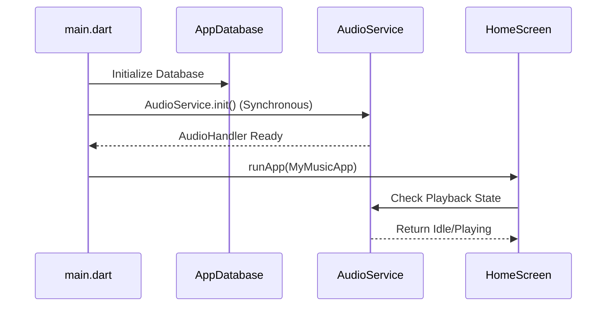

# Technical Specification Document: DownTune Music Player

## 1. Introduction
**DownTune** is a cross-platform (Android-focused) music player built with **Flutter**. It features local music playback, YouTube audio streaming/downloading, and playlist management.

**Target Audience:** C++/Python Developers.
**Key Concept:** Flutter uses a reactive, declarative UI framework similar to React, but compiled to native machine code (like C++). Dart is the language, which feels like a mix of Java and Python.

---

## 2. High-Level Design (HLD)

### 2.1 Architectural Pattern: Feature-First Layered Architecture
The app follows a **Layered Architecture** organized by **Features**. This is similar to a Python project structure where each module (feature) has its own logic and UI.

*   **Presentation Layer (UI):** Widgets (Screens, Components).
*   **Domain/Application Layer (Logic):** Providers (State Management), Controllers.
*   **Data Layer (Infrastructure):** Repositories, Databases, API Clients.

### 2.2 Audio Backend Architecture
The audio system runs as a **Background Service** (Android Service) to ensure playback continues even when the app is closed.

*   **`just_audio`:** The low-level audio player (like a C++ audio engine wrapper). Handles decoding and output.
*   **`audio_service`:** Wraps the player in a background task, handling OS media notifications and lock screen controls.
*   **Communication:** The UI talks to the `AudioHandler` (Singleton) which controls the background service.

### 2.3 External Dependencies
| Dependency | Role | C++/Python Analogy |
|:-----------|:-----|:-------------------|
| **Flutter** | UI Framework | Qt / GTK |
| **Dart** | Language | C++ (syntax) + Python (async) |
| **Riverpod** | State Management | Global State / Dependency Injection |
| **Drift (SQLite)** | Local Database | SQLite / SQLAlchemy |
| **YoutubeExplode** | YouTube API | `yt-dlp` (Python library) |

---

## 3. Low-Level Design (LLD)

### 3.1 Data Models (Structs/Classes)

#### `Song`
Represents a media item.
```dart
class Song {
  final int id;
  final String title;
  final String artist;
  final String path; // File path or URL
  final Duration duration;
  // ...
}
```

#### `Playlist`
Collection of songs.
```dart
class Playlist {
  final int id;
  final String name;
  final List<Song> songs;
}
```

### 3.2 State Management (Riverpod)
**Concept:** Instead of passing pointers/references everywhere, we use "Providers" (smart global variables) that the UI "watches". When data changes, the UI rebuilds automatically (Observer Pattern).

*   **`Provider`:** Read-only value (like a `const` global).
*   **`StateProvider`:** Mutable value (like a global variable).
*   **`StateNotifierProvider`:** Complex state logic (like a C++ class with internal state and methods to modify it).

**Analogy:**
```python
# Python/Riverpod Analogy
class PlayerStateNotifier:
    def __init__(self):
        self.state = "PAUSED" # The data
        self.observers = []   # The UI widgets

    def play(self):
        self.state = "PLAYING"
        self.notify_observers() # UI rebuilds automatically
```

---

## 4. Control Flow & Logic

### 4.1 App Start -> Playback Initialization


### 4.2 Audio Service Lifecycle
1.  **Init:** `AudioService.init()` creates the background isolate (thread).
2.  **Running:** The `MyAudioHandler` class receives events (Play, Pause, Seek) from the UI.
3.  **Background:** Even if the UI is destroyed (User swipes away app), the `AudioService` keeps running until explicitly stopped.

---

## 5. UI Design Specification

### 5.1 Widget Tree (Hierarchy)
In Flutter, **Everything is a Widget** (like Objects in OOP). The tree structure defines the UI.

```text
MyMusicApp (Root)
 └── MaterialApp (App Config)
      └── Scaffold (Basic Layout Structure)
           ├── BottomNavigationBar (Tabs)
           └── Stack (Content Layer)
                ├── IndexedStack (Screens: Home, Library, Settings)
                │    ├── HomeScreen
                │    ├── LibraryScreen
                │    └── SettingsScreen
                └── Positioned (MiniPlayer - Floating above content)
```

### 5.2 Responsiveness
*   **`MediaQuery`:** Used to get screen size (width/height).
*   **`Flexible`/`Expanded`:** Widgets that take up remaining space (like Flexbox in CSS or Qt layouts).

---

## 6. Project Structure & File Map

### 6.1 Directory Map
```text
/lib
 ├── main.dart                  # Entry Point (int main())
 ├── core/                      # Shared utilities & Infrastructure
 │    ├── database/             # SQLite Tables & Logic
 │    ├── services/             # AudioHandler, FileScanner
 │    └── theme/                # Colors, Fonts
 ├── features/                  # Feature Modules
 │    ├── home/                 # Home Screen UI
 │    ├── player/               # Player UI & Logic (MiniPlayer, Full Screen)
 │    ├── local_music/          # Library (Scanning files)
 │    ├── playlists/            # Playlist Management
 │    └── online_music/         # Online Search, Streaming, & Chunk Downloader
 └── shared/                    # Reusable Widgets (Buttons, NavBars)
```

### 6.2 Key Files
*   **`pubspec.yaml`:** Project configuration (Dependencies, Assets). Like `requirements.txt` or `CMakeLists.txt`.
*   **`lib/main.dart`:** The starting point. Initializes services and launches the UI.
*   **`lib/core/services/audio_handler.dart`:** The "Engine Room". Contains the logic for playing audio, handling queues, and interfacing with the OS.

### 6.3 Function Dictionary
| Function | File | Role |
|:---------|:-----|:-----|
| `main()` | `main.dart` | App entry point. Initializes DB and Audio. |
| `AudioService.init()` | `main.dart` | Starts the background audio engine. |
| `play()` | `audio_handler.dart` | Commands the player to start audio. |
| `pause()` | `audio_handler.dart` | Commands the player to pause. |
| `seek(Duration)` | `audio_handler.dart` | Jumps to a specific timestamp. |
| `build(BuildContext)` | Any Widget | The "Render" function. Returns the UI for that component. |
